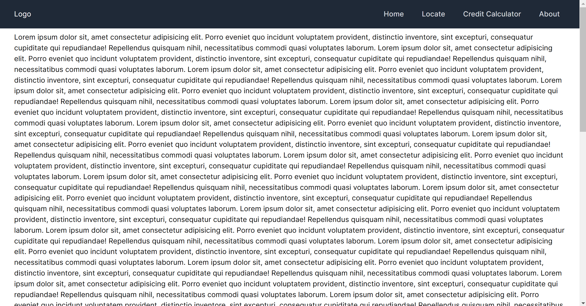
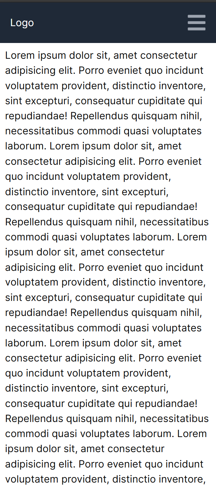
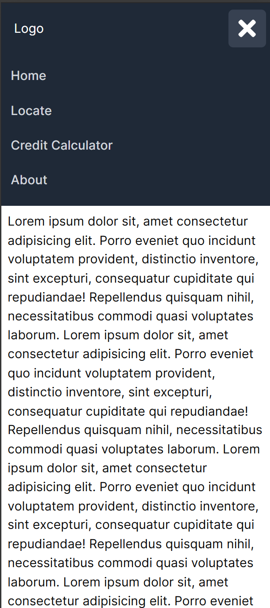

## Things to know about this template :

- using shadcn in this
- this would be suitable for most use cases
- this is mobile responsive
- navbar has hamburgur menu integrated

## Desktop

## Mobile
### Menu closed

### Menu open
